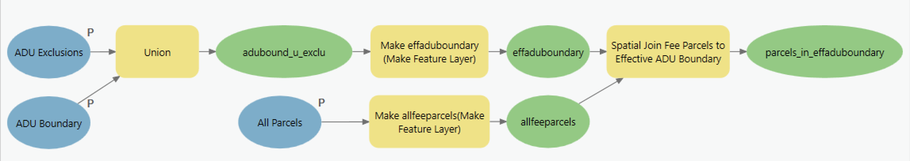

# 1 | Define Parcels in ADU Boundary

### Overview

The first model, 1 | Define Parcels in ADU Boundary, generates a Feature Class of tax parcels in the municipality that have their centroids within the Effective ADU Boundary (effaduboundary), defined as the ADU Boundary less ADU Exclusions.

### Inputs

* [aduboundary](../analysis-preparation/spatial-inputs/1.-adu-boundary.md)
* [aduexclusions](../data-preparation.md)
* [allparcels](../analysis-preparation/spatial-inputs/step-1.-all-parcels.md)

### Outputs

* parcels\_in\_effaduboundary

### Key Assumptions

* Only parcels with a Type of Parcel (poly\_type) equal to "FEE" are preserved.
* Only parcels with centroids in the Effective ADU Boundary are preserved. This may mean some parcels, particularly those with less uniform shapes, are preserved or discarded in a way that is undesirable.

