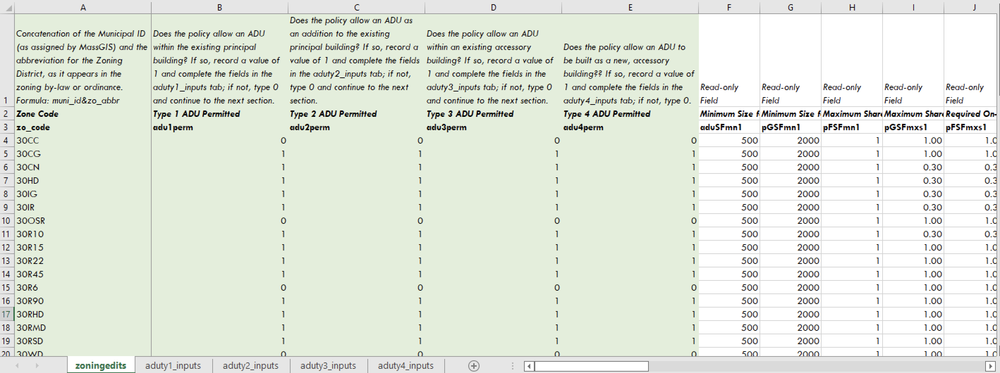

# Tabular Inputs

The ADU Analytical Tool requires both tabular and spatial inputs, which together define the ADU policy the tool will evaluate. In general, Tabular Inputs define binary and numerical elements of the policy, such as whether a particular ADU Typology is allowable and a minimum size for the principal building on a parcel, for it to be considered eligible. Spatial Inputs, in contrast, define location relationships, such as the ADU Boundary and spatial features which, if present on a parcel, would yield it ineligible for an ADU.

Tabular Inputs are organized into a single Excel spreadsheet, **zoningedits\_FINALTEMPLATE.xlsx**, present in the downloaded folder. The spreadsheet has five tabs, one tab with inputs that are required regardless of the ADU policy, and four tabs corresponding to each of the ADU typologies. If the ADU policy does not allow a particular ADU typology, that tab does not need to be completed. The following sections describe these inputs in greater detail.

