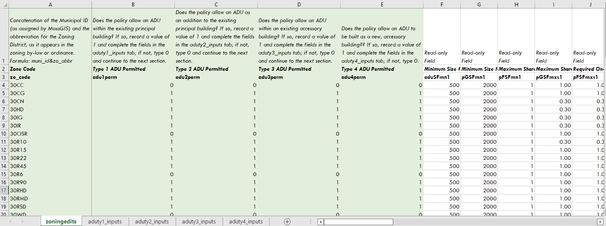

# Required Fields

The first tab of the Excel Spreadsheet, **zoningedits**, is required regardless of the ADU policy. To begin, a user must populate Column A, Zone Code, with rows corresponding to each of the base zoning districts in the municipality. While the tool will likely function with any text string, we highly recommend using a concatenation of the Municipal ID and the abbreviation for the zoning district, as it appears in the zoning bylaw or ordinance. Regardless, the Zone Code field must be identical in structure to the Zone Code field in the [Zoning Spatial Input](../spatial-inputs/3-1.-zoning.md), as these two fields will be joined in the automated analysis.

Once Column A is complete, a user must populate columns B, C, E, and E with 1s and 0s describing if that ADU Typology is allowable in that zoning district. Columns F through AG may be ignored; they are read-only fields that look up values specified in the other four tabs.

