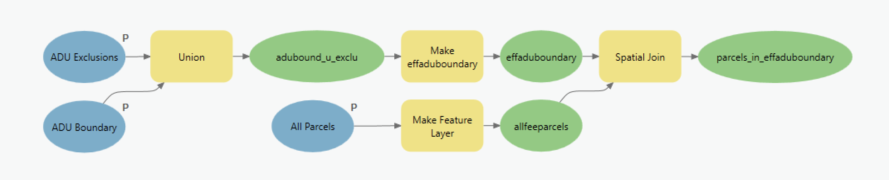

# 1 | Define Parcels in ADU Boundary

### Overview

The first model, 1 | Define Parcels in ADU Boundary, generates a Feature Class of tax parcels in the municipality that have their centroids within the user-defined ADU Boundary and are not overlaid by user-defined ADU Exclusions.

### Inputs

* [aduboundary](../analysis-preparation/spatial-inputs/1.-adu-boundary.md)
* [aduexclusions](../analysis-preparation/spatial-inputs/2.-adu-exclusions.md)
* [allparcels](../analysis-preparation/spatial-inputs/3.-all-parcels.md)

### Outputs

* parcels\_in\_effaduboundary

### Key Assumptions

