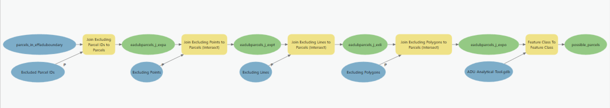

# 2 | Define Possible Parcels

### Overview

The second model, 2 | Define Possible Parcels, generates a Feature Class comprised of fee parcels in the Effective ADU Boundary (effaduboundary) that do not have an excluded Parcel ID (parloc\_id) or an excluded feature (point, line, and/or polygon).

### Inputs

* [excl\_parcels](../analysis-preparation/spatial-inputs/2.-parcel-level-exclusions/2-1.-excluded-parcel-ids.md)
* [excl\_points](../analysis-preparation/spatial-inputs/2.-parcel-level-exclusions/2-2.-excluding-points.md)
* [excl\_lines](../analysis-preparation/spatial-inputs/2.-parcel-level-exclusions/2-3.-excluding-lines.md)
* [excl\_polygons](../analysis-preparation/spatial-inputs/2.-parcel-level-exclusions/2-4.-excluding-polygons.md)
* parcels\_in\_effaduboundary (Generated from [1 | Define Parcels in ADU Boundary](../analysis-overview/page-1.md))

### Outputs

* possible\_parcels

### Key Assumptions

* XXX

