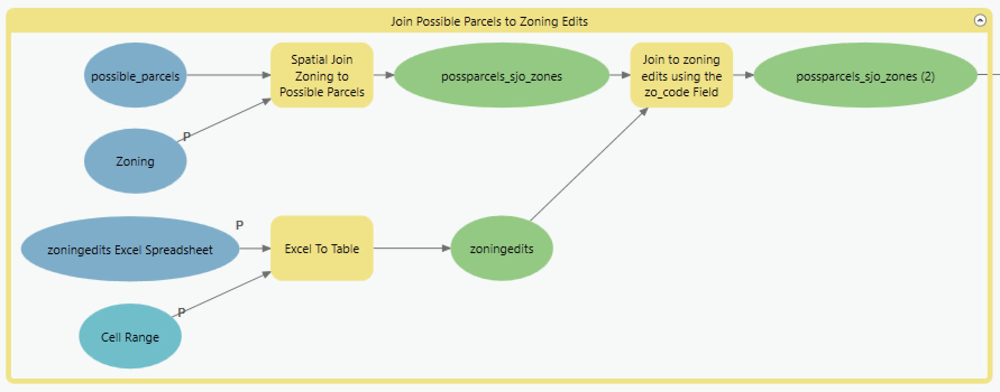

# 3 | Prepare Spatial Data for Fit Tests

### Overview

The third model, 3 | Prepare Spatial Data for Fit Tests, joins the Zoning Edits table to the Possible Parcels Feature Class and then to the Structures input. It generates two outputs:&#x20;

* possparcels\_sjo\_zones, which has the same number of parcels as the Possible Parcels (possible\_parcels) Feature Class but has additional fields with the parcel's base zoning district, and the associated user-provided policy inputs.
* relstructures\_sjo\_zones, which only contains structures that have their center in a parcel in the Possible Parcels Feature Class. As with the possparcels\_sjo\_zones output, the resulting structures data has additional fields with the associated parcel, that parcel's base zoning district, and the associated user-provided policy inputs.

### Inputs

* [zoningedits](../preparation/tabular-inputs/) Excel Spreadsheet and Cell Range
* [zoning\_base](../preparation/spatial-inputs/3-1.-zoning.md)
* [allstructures](../preparation/spatial-inputs/3-2.-all-structures.md)
* possible\_parcels (Generated from [2 | Define Possible Parcels](2-or-define-possible-parcels.md))

### Outputs

* possparcels\_sjo\_zones
* restructures\_sjo\_zones

### Key Assumptions

* Parcels are joined to a single zoning district
* Structures are joined to a single parcel, but multiple structures may be joined to a parcel

