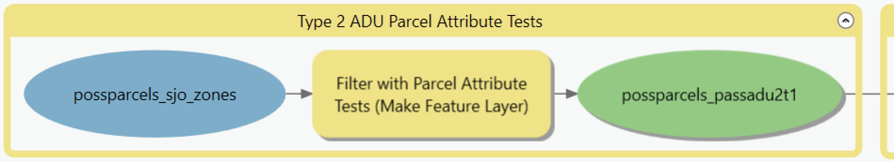
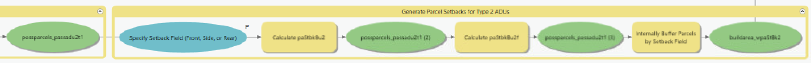
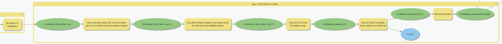

# 4-2 | Type 2 ADU Fit Test

### Overview

The fourth model, 4-2 | Type 2 ADU Fit Test, uses the policy parameters recorded in the zoningedits Excel spreadsheet -- attached to the parcel data and structure data in the previous step -- to evaluate whether a Type 2 ADU, that is, an ADU built as an addition to an existing structure, will fit on the parcel.

#### Test One: Parcel Attributes

#### Test Two: Parcel Fit Tests

_Generate Parcel Setbacks for Type 2 ADUs_

_Combine Buildable Areas and Unbuildable Area (Structures)_

.png>)

### Inputs

* Parcel Setback Field: Front (pafrStbk2), Side (pasiStbk2), or Rear (pareStbk2). These fields correspond with fields in the [zoningedits](../tool-inputs/tabular-inputs/) Excel Spreadsheet
* possparcels\_sjo\_zones (Generated from [3 | Prepare Spatial Data for Fit Tests](3-or-prepare-spatial-data-for-fit-tests.md))
* relstructures\_sjo\_zones (Generated from [3 | Prepare Spatial Data for Fit Tests](3-or-prepare-spatial-data-for-fit-tests.md))

### Outputs

* adjbuildarea2\_passadut3

### Key Assumptions

* XXX

