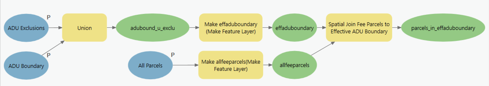

# 1 | Define Parcels in ADU Boundary

The first model, 1 | Define Parcels in ADU Boundary, generates a feature class comprised of fee parcels in the Study Municipality that have their centroids within the Effective ADU Boundary.

### Model Inputs

* [aduboundary](../analysis-preparation/spatial-inputs/1-1.-adu-boundary.md)
* [aduexclusions](../analysis-preparation/spatial-inputs/1-2.-adu-exclusions.md)
* [allparcels](../analysis-preparation/spatial-inputs/1-3.-all-parcels.md)

### Model Outputs

* parcels\_in\_effaduboundary

### Key Assumptions

* Only parcels with a Type of Parcel (poly\_type) equal to "FEE" are preserved.
* Only parcels with centroids in the Effective ADU Boundary are preserved. This may mean some parcels, particularly those with less uniform shapes, are preserved or discarded in a way that is undesirable to the user.

### Analysis

The first model generates a feature class comprised of fee parcels in the Study Municipality that have their centroids within the Effective ADU Boundary (effaduboundary), defined as the ADU Boundary (aduboundary) input less ADU Exclusions (aduexclusions) input.

_Model Design_

