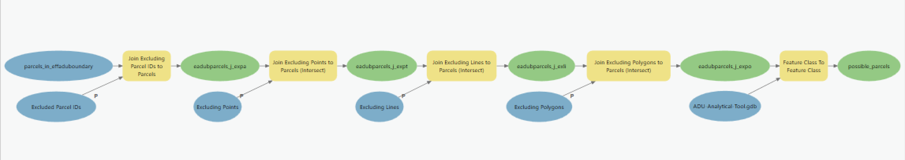

# 2 | Define Possible Parcels

The second model, 2 | Define Possible Parcels, generates a feature class comprised of fee parcels in the Effective ADU Boundary (effaduboundary) that do not have an excluded Parcel ID (parloc\_id) or an excluded feature (point, line, and/or polygon).

### Model Inputs

* [excl\_points](../analysis-preparation/spatial-inputs/2.-parcel-level-exclusions/2-2.-excluding-points.md)
* [excl\_lines](../analysis-preparation/spatial-inputs/2.-parcel-level-exclusions/2-3.-excluding-lines.md)
* [excl\_polygons](../analysis-preparation/spatial-inputs/2.-parcel-level-exclusions/2-4.-excluding-polygons.md)
* [excl\_parcels](../analysis-preparation/spatial-inputs/2.-parcel-level-exclusions/2-1.-excluded-parcel-ids.md)
* parcels\_in\_effaduboundary (Generated from [1 | Define Parcels in ADU Boundary](1-or-define-parcels-in-adu-boundary.md))

### Model Outputs

* possible\_parcels

### Key Assumptions

* The presence of any excluding feature will result in the elimination of a parcel from the analysis. The Analytical Tool does not, at this time, include a means to differentiate by quantities of an excluding feature, such as percent coverage by Excluding Polygons.

### Analysis

The second model generates a feature class comprised of fee parcels in the Effective ADU Boundary (effaduboundary) that do not have an excluded Parcel ID (parloc\_id) or an excluded feature (point, line, and/or polygon).

_Model Design_

