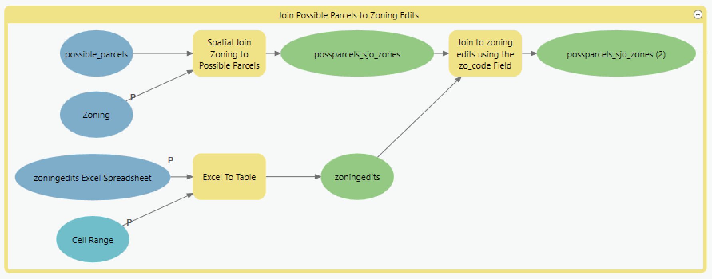

# 3 | Prepare Spatial Data for Fit Tests

The third model, 3 | Prepare Spatial Data for Fit Tests, joins the Zoning Edits table to the Possible Parcels Feature Class and then to the Structures input. It generates the data needed to perform the ADU Fit Tests.

### Model Inputs

* [zoningedits](../analysis-preparation/tabular-inputs/) Excel Spreadsheet and Cell Range
* [zoning\_base](../analysis-preparation/spatial-inputs/3-1.-zoning.md)
* [allstructures](../analysis-preparation/spatial-inputs/3-2.-all-structures.md)
* possible\_parcels (Generated from [2 | Define Possible Parcels](2-or-define-possible-parcels.md))

### Model Outputs

* possparcels\_sjo\_zones
* restructures\_sjo\_zones

### Key Assumptions

* Parcels are joined to a single zoning district
* Structures are joined to a single parcel, though multiple structures may be joined to a single parcel

### Analysis

The third model joins the Zoning Edits table to the Possible Parcels Feature Class and then to the Structures input. It generates two outputs:&#x20;

* possparcels\_sjo\_zones, which has the same number of parcels as the Possible Parcels (possible\_parcels) Feature Class but has additional fields with the parcel's base zoning district, and the associated user-provided policy inputs.
* relstructures\_sjo\_zones, which only contains structures that have their center in a parcel in the Possible Parcels Feature Class. As with the possparcels\_sjo\_zones output, the resulting structures data has additional fields with the associated parcel, that parcel's base zoning district, and the associated user-provided policy inputs.

_Model Design_

