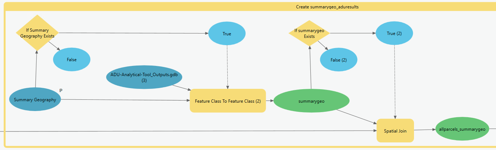

# 5 | Summary of Results

The fifth model, 5 | Summary of Results, joins the outputs from the four ADU Fit Tests back to the All Parcels input, to generate a complete table of results. A value of "1" is assigned in an ADU Type column (1, 2, 3, or 4) when that parcel is likely eligible for that type of ADU; a value of "0" indicates that the parcel is likely ineligible for that type of ADU.&#x20;

The model then optionally summarizes these results by user-specified summary geography, such as neighborhood boundaries. This offers one way to understand the possible results of ADU development under current and proposed ADU policies.

### Model Inputs

* [allparcels](../analysis-preparation/spatial-inputs/1-3.-all-parcels.md)
* [summarygeo](../preparation/spatial-inputs/5-1.-summary-geography.md) (Optional Input)
* Results from ADU Typology Fit Tests:
  * parcels\_passforadu1 (Parcels likely eligible for Type 1 or Principal-Existing, ADUs)&#x20;
  * parcels\_passforadu2 (Parcels likely eligible for Type 2 or Principal-New, ADUs)&#x20;
  * parcels\_passforadu3 (Parcels likely eligible for Type 3 or Accessory-Existing, ADUs)&#x20;
  * parcels\_passforadu4 (Parcels likely eligible for Type 4 or Accessory-New, ADUs)&#x20;

### Model Outputs

* allparcels\_aduresults
* summarygeo\_aduresults

### Key Assumptions

* The analysis assumes a maximum of one ADU (per ADU typology) per parcel
* Parcels may only be associated with one summary geography.

### Analysis

The fifth model joins the outputs from the four ADU Fit Tests back to the All Parcels input, to generate a complete table of results. A value of "1" is assigned in an ADU Type column (1, 2, 3, or 4) when that parcel is likely eligible for that type of ADU; a value of "0" indicates that the parcel is likely ineligible for that type of ADU.&#x20;

_Model Design_



<figure><figcaption>
Click to expand
</figcaption></figure>



<figure><figcaption>
Click to expand
</figcaption></figure>



<figure><figcaption>
Click to expand
</figcaption></figure>



The model then optionally summarizes these results by user-specified summary geography, such as neighborhood boundaries. This offers one way to understand the possible results of ADU development under current and proposed ADU policies.

_Model Design_



<figure><figcaption>
Click to expand
</figcaption></figure>



<figure><figcaption>
Click to expand
</figcaption></figure>



__
