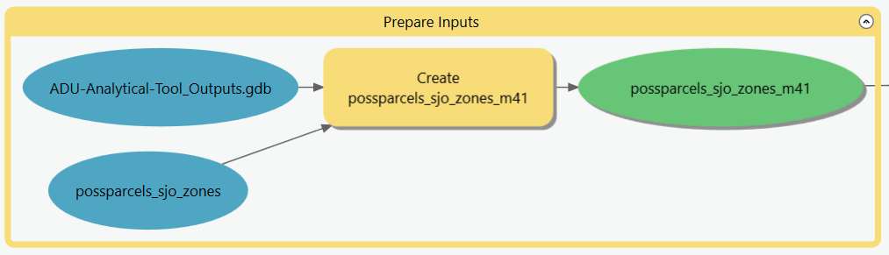

# Overview and Operation

The ADU Analytical Tool is a sequence of ArcPro [model tools](https://pro.arcgis.com/en/pro-app/latest/help/analysis/geoprocessing/modelbuilder/create-a-model-tool.htm) that automate the geoprocessing operations needed to evaluate parcel eligibility. The model tools must be used in order, as the inputs for tools later in the sequence are produced by tools earlier in the sequence.&#x20;

To begin, use the ArcGIS Catalog to navigate to the downloaded folder, then to Toolboxes, then to **2022-07-27\_ADU-Analytical-Tool.tbx**.&#x20;

&#x20;.png>)

Expand the toolbox to show the model tools, right click on the first tool, and then click Open.

This will open a dialogue box with the parameters (Tabular Inputs and/or Spatial Inputs) required for that model. The parameter names in each dialogue box correspond with the names of the inputs described in this guidebook. Provided the locations and names of these files are consistent with the guidebook, a user should simply double check the names and file paths and click Run.

.png>)

Once complete, navigate to the next model tool in the sequence, again confirming parameters and clicking Run.
